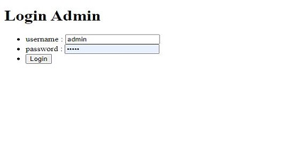
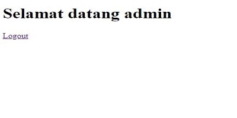

# Biodata

Nama : Anyan

Kelas : php_Post

Email : <a>anyanboys@gmail.com</a>

# Link Deploy
https://github.com/Anyanboys/app_pencatatan_penjualan (Deploy Link Sudah Bisa)

## Cara Instalasi ke Server Lokal :

-   Follow Github https://github.com/Anyanboys
-   Star Repo Github Saya
-   Fork Repo Github Saya
-   clone project repo saya dengan cara menuliskan pada terminal/cmd/git bash : git clone https://github.com/Anyanboys/app_pencatatan_penjualan
-   lalu masuk ke direktori repo yg sudah di clone dengan ketik lg pada terminal/cmd/git bash <b>cd Portofolio</b>
-   lalu ketik composser install dan php artisan key generate (jangan lupa salin dan setting file env)
-   migrate database pada terminal/cmd/git bash
-   jalankan php artisan db:seed pada terminal/cmd/git bash

Notes : Jika Sudah Menjalankan php artisan serve untuk mengakses alamat

## Aplikasi Screenshot

